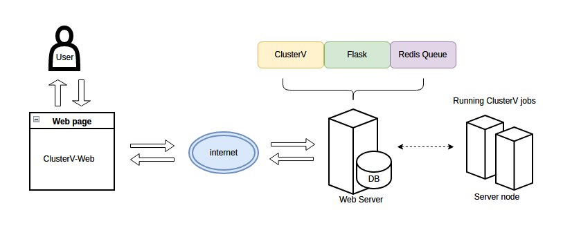

# ClusterV-Web: a web application for finding HIV quasispecies from ONT sequencing data

[](https://opensource.org/licenses/BSD-3-Clause) 
[](https://www.docker.com/)
[](https://nanoporetech.com/)


Contact: Ruibang Luo, Junhao Su  
Email: rbluo@cs.hku.hk, jhsu@cs.hku.hk  

----

## Introduction

ClusterV-Web is a web application for accurately identifying HIV quasispecies from ONT sequencing data base on [ClusterV](https://github.com/HKU-BAL/ClusterV).
ClusterV-Web takes the alignment BAM file, reference FastA file and target region BED file (defining the target regions) of the HIV data as input, and outputs all found quasispecies with their abundance, alignment, variants (SNPs and INDELs), and the drug resistance reports.

A web application is hosted by BAL and are available at this site ([http://bio8.cs.hku.hk:5000/](http://bio8.cs.hku.hk:5000/)).




## Contents

* [Introduction](#introduction)
* [Installation](#installation)
  + [Option 1. Docker pre-built image](#option-1-docker-pre-built-image)
  + [Option 2. Docker Dockerfile](#option-2-docker-dockerfile)

## Installation

### Option 1. Docker pre-built image
A pre-built docker image is available [here](https://hub.docker.com/r/hkubal/clustervw). With it you can run ClusterV-Web using a single command.

```
docker run --name clustervw -d -p 8000:5000 --rm hkubal/clustervw:latest

# the website should be available at 127.0.0.1:8000, 
# or [YOUR IP]:8000, you can check your IP via `ifconfig`

# close the website by
docker ps
docker rm -f [DOCKER CONTAINER ID FOR CLUSTERVW]
```


### Option 2. Docker Dockerfile
Building a docker image.
```
# clone ClusterV-Web
git clone https://github.com/hku-bal/ClusterV-Web.git
cd ClusterV-Web

# build a docker image named hkubal/clustervw:latest
# might require docker authentication to build docker image 
docker build -f ./Dockerfile -t hkubal/clustervw:latest .

# run clustervw docker image like 
docker run --name clustervw -d -p 8000:5000 --rm hkubal/clustervw:latest

# the website should be available at your 127.0.0.1:8000, or YOUR IP:8000
# you can check your IP via `ifconfig`
# for security concerns, please change `this-is-a-long-secret-key` in ./app/config.py file when building the docker image before you expose your website to the public.

```
